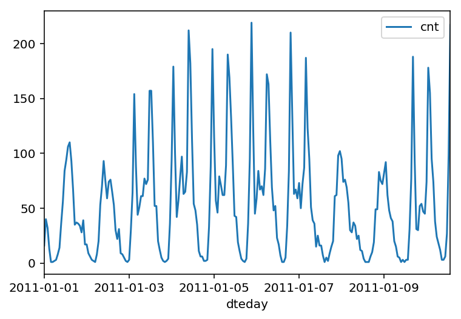

# Project-Bikesharing

In this project, I have built a neural network from scratch to carry out a prediction problem on a real dataset! 
By building a neural network from the ground up, I had a much better understanding of gradient descent, backpropagation, 
and other concepts that are important to know before moving to higher level tools such as PyTorch. 

The data comes from the [UCI Machine Learning Database](https://archive.ics.uci.edu/ml/datasets/Bike+Sharing+Dataset).

This dataset has the number of riders for each hour of each day from January 1 2011 to December 31 2012. The number of riders is split between casual and registered, summed up in the cnt column.

Below is a plot showing the number of bike riders over the first 10 days or so in the data set. (Some days don't have exactly 24 entries in the data set, so it's not exactly 10 days.) You can see the hourly rentals here. This data is pretty complicated! The weekends have lower over all ridership and there are spikes when people are biking to and from work during the week. Looking at the data above, we also have information about temperature, humidity, and windspeed, all of these likely affecting the number of riders. We will be trying to capture all this with our model.

## Prediction

We use the test data to view how well our network is modeling the data. 

