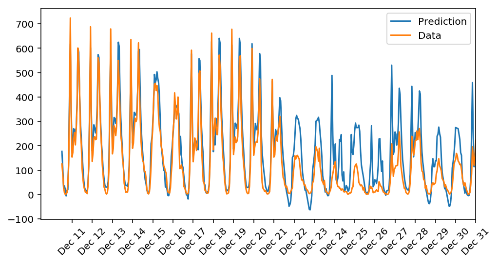

# Project-Bikesharing

This is the first project that I submitted as part of Deep Learning Nanodegree program of Udacity.

In this project, I got to build a neural network from scratch to carry out a prediction problem on a real dataset! 
By building a neural network from the ground up, I had a much better understanding of gradient descent, backpropagation, 
and other concepts that are important to know before we move to higher level tools such as PyTorch. 

The data comes from the [UCI Machine Learning Database](https://archive.ics.uci.edu/ml/datasets/Bike+Sharing+Dataset).

## Prediction

